# BÁO CÁO ĐỒ ÁN CÁ NHÂN MÔN TRÍ TUỆ NHÂN TẠO

**Họ và tên:** Võ Văn Tú

**Mã số sinh viên:** 23110359

**Lớp :** ARIN330585 (CHIỀU THỨ 5)

# 8-PUZZLE SOLVER

## 1. Giới thiệu

### 1.1. Tên dự án
**8-Puzzle Solver**: Ứng dụng giải bài toán 8-puzzle với nhiều thuật toán khác nhau

### 1.2. Tổng quan
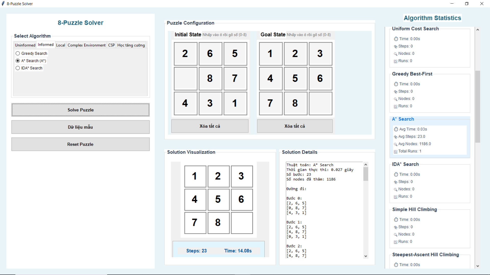
Bài toán 8-puzzle là một trong những bài toán kinh điển trong lĩnh vực trí tuệ nhân tạo, đặc biệt là trong lĩnh vực tìm kiếm. Bài toán bao gồm một bảng trò chơi 3x3 với 8 ô số và 1 ô trống. Mục tiêu của bài toán là di chuyển các ô số để đạt được trạng thái đích từ trạng thái ban đầu.

Ứng dụng 8-Puzzle Solver này cung cấp một giao diện đồ họa người dùng (GUI) trực quan được xây dựng bằng Tkinter, cho phép người dùng thiết lập trạng thái ban đầu và trạng thái đích, chọn thuật toán tìm kiếm mong muốn, và theo dõi quá trình giải bài toán theo từng bước.

Các công nghệ chính được sử dụng trong dự án:
- Python: Ngôn ngữ lập trình chính
- Tkinter: Thư viện GUI cho Python
- NumPy: Hỗ trợ xử lý mảng và ma trận

### 1.3. Mục tiêu
- Cung cấp một nền tảng toàn diện để học tập và so sánh các thuật toán tìm kiếm khác nhau trong lĩnh vực trí tuệ nhân tạo
- Trực quan hóa quá trình giải bài toán 8-puzzle, giúp người dùng hiểu rõ cách thức hoạt động của các thuật toán
- Áp dụng kiến thức về trí tuệ nhân tạo và thuật toán tìm kiếm vào việc giải quyết bài toán 8-puzzle
- Cung cấp công cụ so sánh hiệu suất giữa các thuật toán, bao gồm thời gian thực thi, số bước trong giải pháp và số nút được khám phá

### 1.4. Các tính năng chính
- **Hỗ trợ đa dạng thuật toán**: Bao gồm các thuật toán tìm kiếm không thông tin (BFS, DFS, IDS, UCS), tìm kiếm có thông tin (Greedy, A*, IDA*), tìm kiếm cục bộ (Hill Climbing, Beam Search, Simulated Annealing, Genetic Algorithm),tìm kiếm trong môi trường phức tạp(AND-OR Search, Search with no observation, Partial Observation Search) ,CSP (Backtracking, AC-3, Min-Conflicts), và học tăng cường (Q-Learning)
- **Giao diện người dùng trực quan**: Cho phép dễ dàng thiết lập trạng thái ban đầu và trạng thái đích thông qua nút nhấn Sample Data(dữ liệu mẫu) hoặc nhập trực tiếp từ bàn phím
- **Hiển thị trực quan quá trình giải**: Hiển thị từng bước di chuyển và trạng thái của bảng puzzle theo thời gian thực
- **Thống kê hiệu suất**: Đo lường và hiển thị các chỉ số như thời gian giải, số bước trong giải pháp và số nút được khám phá
- **Lưu và hiển thị kết quả**: Khả năng lưu đường đi giải và các số liệu thống kê vào file và hiển thị dưới dạng văn bản

### 1.5. Cấu trúc dự án

Dự án được tổ chức theo kiến trúc module rõ ràng, giúp dễ dàng mở rộng và bảo trì. Dưới đây là cấu trúc thư mục chi tiết:

```
📁 8puzzle/                         # Thư mục gốc của dự án
│
├── 📄 main.py                     # Điểm vào chính của ứng dụng
│
├── 📁 algorithms/                 # Chứa tất cả các thuật toán tìm kiếm
│   ├── 📄 __init__.py             # File khởi tạo package
│   │
│   ├── 📁 uninformed/             # Thuật toán tìm kiếm không có thông tin
│   │   ├── 📄 bfs.py              # Breadth-First Search
│   │   ├── 📄 dfs.py              # Depth-First Search
│   │   ├── 📄 ids.py              # Iterative Deepening Search
│   │   └── 📄 ucs.py              # Uniform Cost Search
│   │
│   ├── 📁 informed/               # Thuật toán tìm kiếm có thông tin
│   │   ├── 📄 astar.py            # A* Search
│   │   ├── 📄 greedy.py           # Greedy Search
│   │   └── 📄 ida.py              # Iterative Deepening A*
│   │
│   ├── 📁 local/                  # Thuật toán tìm kiếm cục bộ
│   │   ├── 📄 simple_hill_climbing.py         # Simple Hill Climbing
│   │   ├── 📄 steepest_hill_climbing.py       # Steepest-Ascent Hill Climbing
│   │   ├── 📄 stochastic_hill_climbing.py     # Stochastic Hill Climbing
│   │   ├── 📄 simulated_annealing.py          # Simulated Annealing
│   │   ├── 📄 beam_search.py                  # Beam Search
│   │   └── 📄 genetic_algorithm.py            # Genetic Algorithm
│   │
│   ├── 📁 complex environment/                # Thuật toán tìm kiếm trong môi trường phức tạp
│   │   ├── 📄 and_or_search.py               # AND-OR Search
│   │   ├── 📄 sensorless_search.py            # Search with No Observation
│   │   └── 📄 partial_observation_search.py   # Partial Observation Search
│   │
│   ├── 📁 csp/                    # Thuật toán CSP (Constraint Satisfaction Problem)
│   │   ├── 📄 csp_backtracking.py             # Backtracking
│   │   ├── 📄 csp_ac3.py                      # AC-3
│   │   └── 📄 csp_min_conflicts.py            # Min-Conflicts
│   │
│   ├── 📁 reinforcement/          # Thuật toán học tăng cường
│   │   └── 📄 q_learning.py       # Q-Learning
│   │
│   └── 📄 heuristics.py           # Các hàm heuristic dùng chung
│
├── 📁 models/                     # Chứa các mô hình dữ liệu
│   ├── 📄 puzzle.py               # Mô hình bài toán 8-puzzle
│
├── 📁 ui/                         # Giao diện người dùng
│   ├── 📄 main_window.py          # Cửa sổ chính của ứng dụng
│   ├── 📄 puzzle_board.py         # Thành phần hiển thị bảng puzzle
│   └── 📄 interactive_puzzle_board.py # Thành phần hiển thị để nhập trạng thái đầu và đích
│
└── 📁 solutions/                  # Lưu trữ kết quả giải
    └── 📄 solution_logs/          # File logs các lần chạy thuật toán
```

**Mối quan hệ giữa các thành phần:**

- **main.py**: Khởi tạo ứng dụng, tạo cửa sổ chính và chạy vòng lặp chính của Tkinter.

- **Gói algorithms**: Chứa tất cả các thuật toán tìm kiếm, được phân chia theo nhóm:
  - *Tìm kiếm không thông tin*: BFS, DFS, IDS, UCS
  - *Tìm kiếm có thông tin*: A*, Greedy, IDA*
  - *Tìm kiếm cục bộ*: Hill Climbing, Beam Search, Simulated Annealing, Genetic Algorithm
  - *Tìm kiếm trong môi trường phức tạp*: AND-OR, Search with no observation, Partial Observation
  - *CSP*: Backtracking, AC-3, Min-Conflicts
  - *Học tăng cường*: Q-Learning

- **Gói models**: Định nghĩa cấu trúc dữ liệu cốt lõi của bài toán, bao gồm:
  - *Puzzle*: Biểu diễn trạng thái bảng, các thao tác và kiểm tra mục tiêu
- **Gói ui**: Xây dựng giao diện người dùng với Tkinter:
  - *MainWindow*: Quản lý layout chính và các tương tác người dùng
  - *PuzzleBoard*: Hiển thị và cập nhật trạng thái của bảng puzzle

Các module trong dự án được tổ chức theo nguyên tắc tách biệt, với mỗi thuật toán được triển khai trong một file riêng biệt, giúp dễ dàng mở rộng và bảo trì. Giao diện người dùng (UI) và logic nghiệp vụ được tách riêng, giúp đảm bảo tính mô-đun và khả năng tái sử dụng.

## 2. Nội dung

### 2.1. Bài toán 8-puzzle

Bài toán 8-puzzle là một trong những bài toán kinh điển trong lĩnh vực trí tuệ nhân tạo. Được mô tả đơn giản, 8-puzzle bao gồm một bảng trò chơi 3x3 với 8 ô số (từ 1 đến 8) và một ô trống (thường được biểu diễn là số 0). Mục tiêu của bài toán là di chuyển các ô từ một cấu hình ban đầu để đạt được cấu hình đích.

**Biểu diễn trạng thái:**
Trong dự án này, trạng thái của 8-puzzle được biểu diễn dưới dạng ma trận 3x3, ví dụ:
```
[1, 2, 3]
[4, 0, 5]
[7, 8, 6]
```

Nơi số 0 đại diện cho ô trống. Ô trống có thể di chuyển lên, xuống, trái, phải (nếu vị trí cho phép) để hoán đổi vị trí với các ô số liền kề.

**Không gian trạng thái:**
Không gian trạng thái của bài toán 8-puzzle rất lớn, với tổng cộng 9!/2 = 181,440 trạng thái có thể đạt được. Mỗi trạng thái có thể có tối đa 4 trạng thái kế tiếp, tương ứng với 4 hướng di chuyển có thể của ô trống.

**Độ phức tạp của bài toán:**
Mặc dù không gian trạng thái tương đối lớn, bài toán 8-puzzle thuộc loại P-SPACE-complete, có nghĩa là không có thuật toán đa thức nào có thể giải quyết mọi trường hợp một cách tối ưu. Tuy nhiên, với các heuristic phù hợp, các thuật toán như A* thường có thể tìm được giải pháp tối ưu trong thời gian hợp lý cho hầu hết các trường hợp.

**Một điều quan trọng cần lưu ý** là không phải mọi cấu hình của 8-puzzle đều có thể đạt được từ mọi cấu hình khác. Cụ thể, không gian trạng thái của 8-puzzle được chia thành hai tập hợp không giao nhau, và không có cách nào để di chuyển từ một tập hợp này sang tập hợp kia. Điều này được xác định thông qua tính chẵn lẻ của số lần đảo trong cấu hình.

### 2.2. Các thuật toán tìm kiếm không có thông tin

#### Thành phần chính của bài toán tìm kiếm

**Không gian trạng thái:** Tập hợp tất cả các cấu hình có thể có của bảng 8-puzzle. Mỗi trạng thái là một ma trận 3x3 biểu diễn vị trí của các số từ 0 đến 8.

**Trạng thái ban đầu:** Cấu hình ban đầu của bảng puzzle, do người dùng thiết lập.

**Trạng thái đích:** Cấu hình mong muốn cuối cùng, thường là các số được sắp xếp theo thứ tự với ô trống ở một vị trí cụ thể.

**Hàm kế thừa và các hành động:** Các hành động hợp lệ trong bài toán 8-puzzle là di chuyển ô trống lên, xuống, trái, hoặc phải (nếu có thể). Hàm kế thừa xác định các trạng thái có thể đạt được từ trạng thái hiện tại bằng cách áp dụng các hành động này.

**Giải pháp:** Một chuỗi các hành động di chuyển từ trạng thái ban đầu đến trạng thái đích.

#### Chi tiết các thuật toán

**1. Breadth-First Search (BFS)**

BFS khám phá không gian trạng thái theo chiều rộng, mở rộng tất cả các nút ở độ sâu hiện tại trước khi đi sâu hơn.
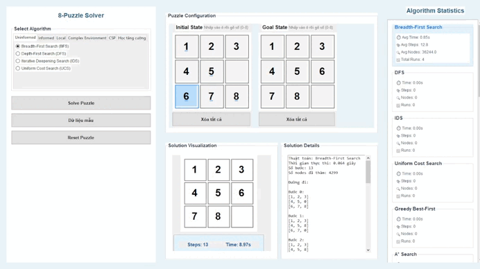

*Ưu điểm:*
- Luôn tìm được đường đi ngắn nhất (tối ưu về số bước)
- Đảm bảo tìm được giải pháp nếu có

*Nhược điểm:*
- Tiêu tốn nhiều bộ nhớ khi không gian trạng thái lớn
- Không hiệu quả cho các bài toán có giải pháp ở độ sâu lớn

**2. Depth-First Search (DFS)**

DFS khám phá không gian trạng thái theo chiều sâu, đi sâu nhất có thể trước khi quay lui.
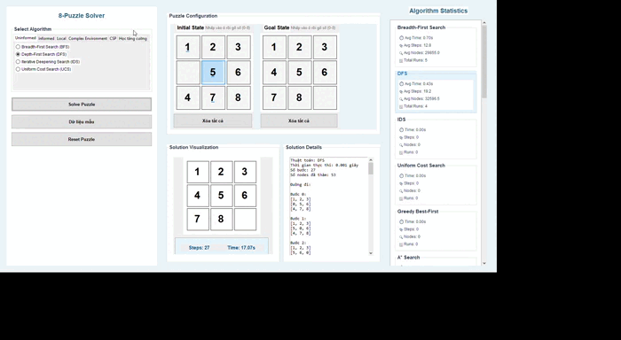

*Ưu điểm:*
- Tiêu tốn ít bộ nhớ hơn BFS
- Có thể tìm được giải pháp nhanh hơn nếu giải pháp nằm sâu trong không gian tìm kiếm

*Nhược điểm:*
- Không đảm bảo tìm được đường đi ngắn nhất
- Trong bài toán 8-puzzle, thường không hiệu quả do không gian trạng thái rộng

**3. Iterative Deepening Search (IDS)**

IDS kết hợp ưu điểm của BFS và DFS bằng cách thực hiện DFS với độ sâu giới hạn, sau đó tăng dần giới hạn độ sâu.
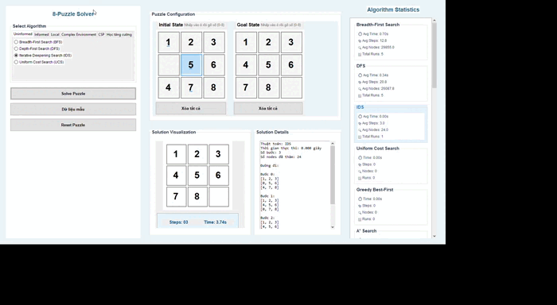

*Ưu điểm:*
- Đảm bảo tìm được đường đi ngắn nhất
- Tiêu tốn ít bộ nhớ hơn BFS

*Nhược điểm:*
- Tái khám phá nhiều nút qua các lần lặp
- Chậm hơn khi giải pháp nằm ở độ sâu lớn

**4. Uniform Cost Search (UCS)**

UCS mở rộng nút có chi phí tích lũy nhỏ nhất, trong trường hợp 8-puzzle, chi phí là số bước di chuyển.
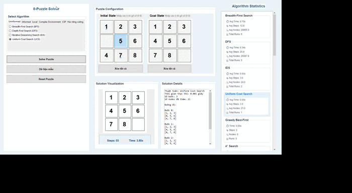

*Ưu điểm:*
- Tối ưu khi chi phí đường đi là mục tiêu
- Đảm bảo tìm được đường đi có chi phí thấp nhất

*Nhược điểm:*
- Tiêu tốn nhiều bộ nhớ, tương tự BFS
- Kém hiệu quả nếu không gian tìm kiếm rộng

#### So sánh hiệu suất

Trong bài toán 8-puzzle, hiệu suất của các thuật toán tìm kiếm không thông tin thay đổi đáng kể tùy thuộc vào độ phức tạp của cấu hình ban đầu:

**Thời gian tìm kiếm:** BFS và UCS thường nhanh hơn đối với các cấu hình đơn giản (cần ít bước di chuyển), trong khi DFS có thể nhanh hơn cho các cấu hình phức tạp. IDS cân bằng giữa hai phương pháp này, nhưng có chi phí tái khám phá cao.

**Số nút đã khám phá:** BFS và UCS thường khám phá nhiều nút hơn so với DFS với cùng một cấu hình. Tuy nhiên, DFS có thể khám phá số lượng nút rất lớn nếu không được kiểm soát tốt.

**Độ dài của đường đi:** BFS, UCS và IDS luôn tìm được đường đi ngắn nhất, trong khi DFS thường cho ra đường đi dài và không tối ưu.

**Bộ nhớ sử dụng:** DFS tiêu tốn ít bộ nhớ nhất, trong khi BFS và UCS có thể nhanh chóng hết bộ nhớ với các cấu hình phức tạp. IDS cân bằng giữa bộ nhớ và khả năng tìm kiếm tối ưu.

**Tính tối ưu:** Đối với bài toán 8-puzzle, trong đó mục tiêu là tìm đường đi ngắn nhất, BFS, UCS và IDS là lựa chọn tối ưu, với IDS thường được ưu tiên cho các cấu hình phức tạp do yêu cầu bộ nhớ thấp hơn.

### 2.3. Các thuật toán tìm kiếm có thông tin

#### Hàm heuristic trong bài toán 8-puzzle

Các thuật toán tìm kiếm có thông tin sử dụng hàm heuristic để ước tính khoảng cách từ trạng thái hiện tại đến trạng thái đích. Trong bài toán 8-puzzle, có một số hàm heuristic phổ biến:

**1. Manhattan Distance (Khoảng cách Manhattan)**

Tổng khoảng cách theo chiều ngang và dọc của mỗi ô từ vị trí hiện tại đến vị trí đích của nó.

```python
def manhattan_distance(state, goal_state):
    distance = 0
    for i in range(3):
        for j in range(3):
            if state[i][j] != 0:  # Bỏ qua ô trống
                # Tìm vị trí của số này trong trạng thái đích
                for k in range(3):
                    for l in range(3):
                        if goal_state[k][l] == state[i][j]:
                            distance += abs(i - k) + abs(j - l)
    return distance
```

**2. Misplaced Tiles (Số ô sai vị trí)**

Đếm số lượng ô không nằm đúng vị trí so với trạng thái đích.

```python
def misplaced_tiles(state, goal_state):
    count = 0
    for i in range(3):
        for j in range(3):
            if state[i][j] != 0 and state[i][j] != goal_state[i][j]:
                count += 1
    return count
```

**3. Linear Conflict (Xung đột tuyến tính)**

Mở rộng của Manhattan Distance, tính thêm chi phí cho các ô nằm đúng hàng/cột nhưng cản trở nhau.

```python
def linear_conflict(state, goal_state):
    # Tính Manhattan Distance trước
    md = manhattan_distance(state, goal_state)
    conflicts = 0
    
    # Kiểm tra xung đột theo hàng
    for row in range(3):
        for i in range(3):
            if state[row][i] == 0:
                continue
            goal_row = (state[row][i] - 1) // 3
            if goal_row == row:  # Nếu ô này đúng hàng
                for j in range(i+1, 3):
                    if state[row][j] == 0:
                        continue
                    goal_row_j = (state[row][j] - 1) // 3
                    if goal_row_j == row and state[row][i] > state[row][j]:
                        conflicts += 1
    
    # Kiểm tra xung đột theo cột (tương tự)
    # ...
    
    return md + 2 * conflicts
```

#### Chi tiết các thuật toán

**1. Greedy Search (Tìm kiếm tham lam)**

Greedy Search luôn mở rộng nút có giá trị heuristic thấp nhất, không quan tâm đến chi phí đã đi.
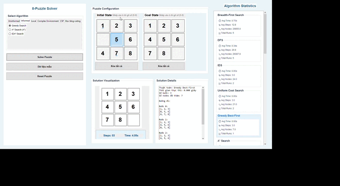

*Ưu điểm:*
- Nhanh và hiệu quả về mặt tính toán
- Tiêu tốn ít bộ nhớ hơn so với A*

*Nhược điểm:*
- Không đảm bảo tìm được đường đi ngắn nhất
- Có thể bị mắc kẹt trong các cực tiểu cục bộ

**2. A* Search (Tìm kiếm A*)**

A* kết hợp chi phí đã đi (g) và ước tính chi phí còn lại (h) để chọn nút mở rộng tiếp theo.
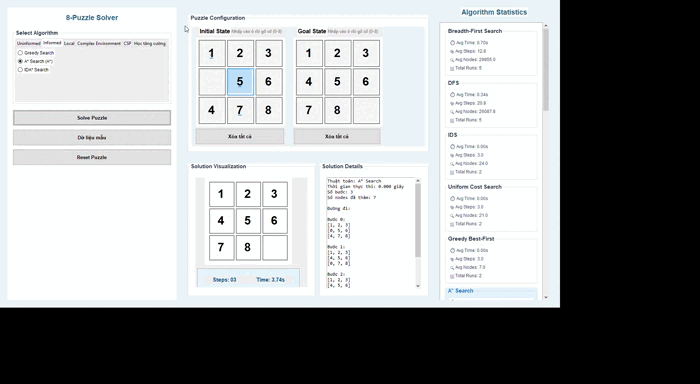

*Ưu điểm:*
- Đảm bảo tìm được đường đi ngắn nhất nếu hàm heuristic không vượt quá chi phí thực
- Hiệu quả hơn BFS và UCS khi hàm heuristic tốt

*Nhược điểm:*
- Tiêu tốn nhiều bộ nhớ
- Hiệu suất phụ thuộc nhiều vào chất lượng của hàm heuristic

**3. IDA* Search (Iterative Deepening A*)**

IDA* kết hợp ý tưởng của IDS và A*, thực hiện tìm kiếm sâu với giới hạn dựa trên giá trị f = g + h.
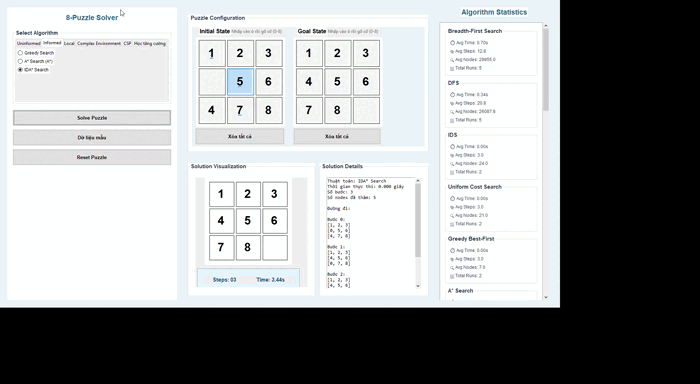

*Ưu điểm:*
- Tiêu tốn ít bộ nhớ hơn A*
- Vẫn đảm bảo tìm được đường đi ngắn nhất

*Nhược điểm:*
- Tái khám phá nhiều nút qua các lần lặp
- Chậm hơn A* trong nhiều trường hợp

#### So sánh hiệu suất với nhóm không thông tin

Các thuật toán tìm kiếm có thông tin thường vượt trội hơn so với các thuật toán không thông tin trong bài toán 8-puzzle:

**Thời gian tìm kiếm:** A* và IDA* thường nhanh hơn đáng kể so với BFS, DFS, và IDS, đặc biệt đối với các cấu hình phức tạp. Greedy Search có thể nhanh nhất nhưng không đảm bảo tối ưu.

**Số nút đã khám phá:** Các thuật toán có thông tin khám phá ít nút hơn nhiều so với các thuật toán không thông tin. A* với hàm heuristic tốt có thể giảm số nút khám phá xuống hàng chục lần so với BFS.

**Tính tối ưu:** A* và IDA* đảm bảo tìm được đường đi ngắn nhất (giống BFS và UCS), trong khi Greedy Search không có đảm bảo này (giống DFS).

Trong thực tế, A* với Manhattan Distance là lựa chọn phổ biến nhất cho bài toán 8-puzzle, cân bằng giữa hiệu suất và tính tối ưu. IDA* được ưu tiên khi bộ nhớ là hạn chế.

### 2.4. Các thuật toán tìm kiếm cục bộ

Các thuật toán tìm kiếm cục bộ tập trung vào việc cải thiện một trạng thái hiện tại thay vì khám phá toàn bộ không gian trạng thái. Chúng thường được sử dụng khi không gian trạng thái quá lớn để khám phá đầy đủ.

#### Chi tiết các thuật toán

**1. Simple Hill Climbing**

Hill Climbing đơn giản chọn trạng thái kế tiếp có giá trị heuristic tốt hơn trạng thái hiện tại.
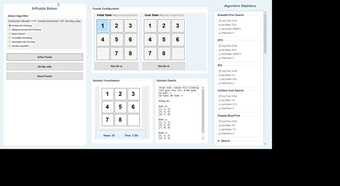

*Ưu điểm:*
- Đơn giản và dễ triển khai
- Tiêu tốn ít bộ nhớ

*Nhược điểm:*
- Dễ bị mắc kẹt ở cực tiểu cục bộ
- Không đảm bảo tìm được giải pháp tối ưu
- Hiệu suất phụ thuộc nhiều vào trạng thái ban đầu

**2. Steepest-Ascent Hill Climbing**

Phiên bản cải tiến của Hill Climbing, xem xét tất cả các trạng thái kế tiếp và chọn trạng thái tốt nhất.
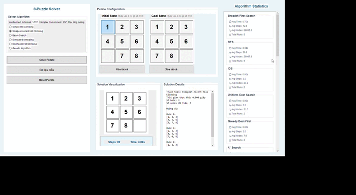

*Ưu điểm:*
- Ít khả năng bị mắc kẹt hơn so với Simple Hill Climbing
- Vẫn tiêu tốn ít bộ nhớ

*Nhược điểm:*
- Vẫn có thể bị mắc kẹt ở cực tiểu cục bộ
- Chậm hơn Simple Hill Climbing do phải đánh giá tất cả các trạng thái kế tiếp

**3. Stochastic Hill Climbing**

Phiên bản ngẫu nhiên của Hill Climbing, chọn ngẫu nhiên một trong các trạng thái kế tiếp tốt hơn.


*Ưu điểm:*
- Có khả năng thoát khỏi cực tiểu cục bộ tốt hơn
- Đơn giản và tiêu tốn ít bộ nhớ

*Nhược điểm:*
- Kém ổn định và khó dự đoán
- Không đảm bảo tìm được giải pháp tối ưu

**4. Simulated Annealing**

Mô phỏng quá trình ủ kim loại, cho phép chấp nhận các trạng thái kém hơn với xác suất giảm dần theo thời gian.


*Ưu điểm:*
- Có khả năng thoát khỏi cực tiểu cục bộ tốt
- Hội tụ đến giải pháp tốt trong nhiều trường hợp

*Nhược điểm:*
- Hiệu suất phụ thuộc vào lịch trình làm mát
- Không đảm bảo tìm được giải pháp tối ưu
- Có thể chậm hơn các phương pháp Hill Climbing đơn giản

**5. Beam Search**

Duy trì một tập hợp các trạng thái tốt nhất (beam) và mở rộng tất cả chúng ở mỗi bước.
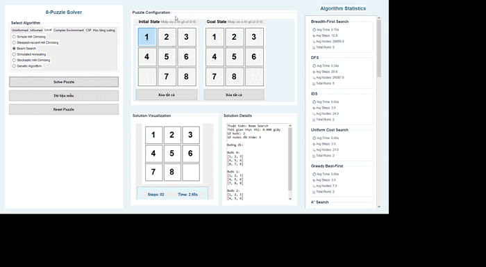

*Ưu điểm:*
- Khám phá nhiều đường đi cùng lúc
- Ít khả năng bị mắc kẹt ở cực tiểu cục bộ hơn so với Hill Climbing

*Nhược điểm:*
- Tiêu tốn nhiều bộ nhớ hơn các phương pháp Hill Climbing
- Không đảm bảo tìm được giải pháp tối ưu
- Hiệu suất phụ thuộc vào kích thước beam

**6. Genetic Algorithm (Thuật toán di truyền)**

Mô phỏng quá trình tiến hóa tự nhiên, sử dụng quần thể các giải pháp và áp dụng các toán tử di truyền như chọn lọc, lai ghép và đột biến.
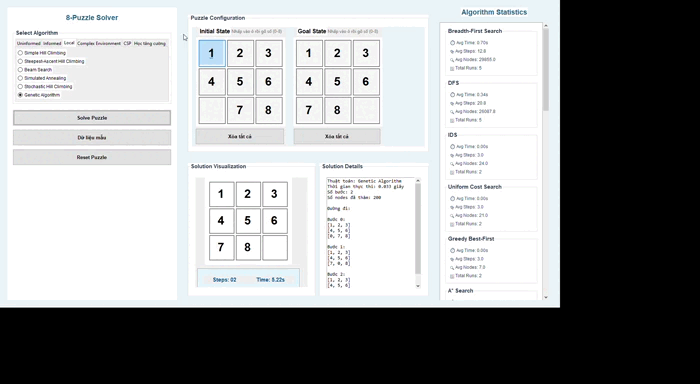

*Ưu điểm:*
- Khả năng tìm kiếm toàn cục tốt
- Có thể tìm được nhiều giải pháp khác nhau
- Hiệu quả cho các không gian trạng thái lớn và phức tạp

*Nhược điểm:*
- Phức tạp trong việc triển khai
- Tiêu tốn nhiều tài nguyên tính toán
- Hiệu suất phụ thuộc vào các tham số như kích thước quần thể, tỷ lệ đột biến, v.v.

#### Ưu và nhược điểm

**Hiệu quả về mặt tính toán:**
Các thuật toán tìm kiếm cục bộ thường hiệu quả hơn về mặt tính toán so với các thuật toán tìm kiếm đầy đủ như BFS hoặc A*. Chúng không cần lưu trữ toàn bộ cây tìm kiếm và thường chỉ cần xem xét một số lượng nhỏ các trạng thái ở mỗi bước.

**Khả năng tìm kiếm tối ưu cục bộ vs toàn cục:**
Các thuật toán như Hill Climbing dễ bị mắc kẹt ở cực tiểu cục bộ. Simulated Annealing và Genetic Algorithm có khả năng thoát khỏi cực tiểu cục bộ tốt hơn và có thể tìm được giải pháp gần tối ưu toàn cục trong nhiều trường hợp.

**Phù hợp với các không gian trạng thái lớn:**
Các thuật toán tìm kiếm cục bộ đặc biệt phù hợp với các bài toán có không gian trạng thái lớn, nơi các thuật toán tìm kiếm đầy đủ không thể áp dụng được do hạn chế về bộ nhớ và thời gian. Trong bài toán 8-puzzle, chúng có thể không phải là lựa chọn tốt nhất do không gian trạng thái tương đối nhỏ và các thuật toán như A* thường hiệu quả hơn.

### 2.5. Các thuật toán tìm kiếm trong môi trường phức tạp

#### AND-OR Search
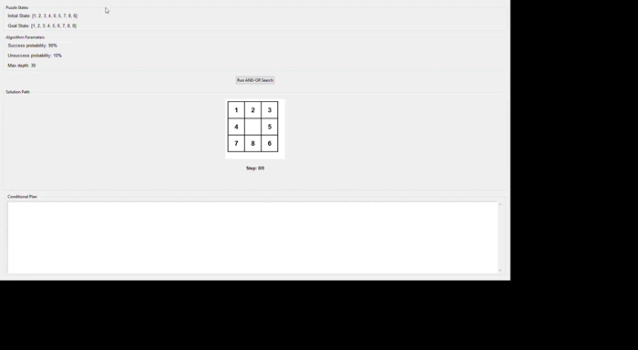

**Cách tiếp cận:**

AND-OR Search là một thuật toán tìm kiếm được thiết kế để giải quyết các bài toán trong môi trường không xác định, nơi kết quả của một hành động có thể không chắc chắn. Thuật toán xây dựng một cây AND-OR, trong đó:
- Các nút OR đại diện cho các trạng thái, với các nhánh là các hành động có thể thực hiện.
- Các nút AND đại diện cho các tập hợp trạng thái có thể xảy ra sau một hành động, với các nhánh là các trạng thái có thể.


**Khi nào sử dụng:**
- Khi kết quả của các hành động không chắc chắn
- Khi cần xây dựng một chiến lược hoàn chỉnh thay vì một chuỗi hành động đơn lẻ
- Trong các môi trường có yếu tố ngẫu nhiên hoặc đối kháng

#### Tìm kiếm với thông tin không đầy đủ

**1. Search with no observation (Tìm kiếm không quan sát)**

Search with no observation giải quyết các bài toán trong đó trạng thái hiện tại không được biết chính xác, nhưng thuộc một tập hợp các trạng thái có thể.
Trong bài toán 8-puzzle, điều này tương đương với việc không biết chính xác cấu hình hiện tại của bảng, nhưng biết nó thuộc một tập hợp các cấu hình có thể. Mục tiêu là tìm một chuỗi hành động đưa tất cả các cấu hình có thể đến trạng thái đích.
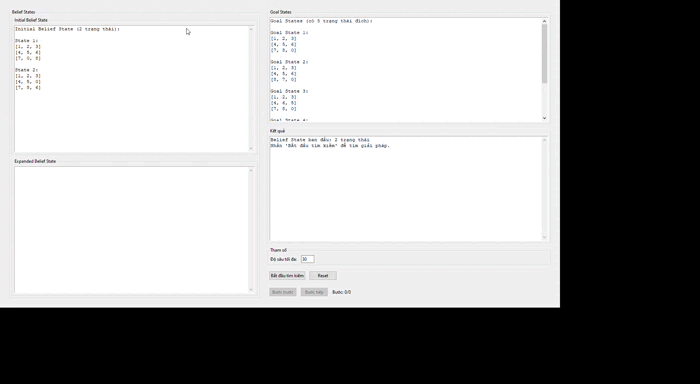

*Cách tiếp cận:*
- Làm việc với tập hợp các trạng thái thay vì một trạng thái đơn lẻ
- Tìm chuỗi hành động tối ưu của tập hợp trạng thái có thể
- Cuối cùng đưa tất cả các trạng thái có thể đến trạng thái đích

**2. Partial Observation Search (Tìm kiếm quan sát một phần)**

Partial Observation Search giải quyết các bài toán trong đó chỉ có thể quan sát một phần của trạng thái, hoặc có thể thực hiện các hành động cảm biến để thu thập thêm thông tin.
Trong bài toán 8-puzzle, điều này có thể tương đương với việc chỉ nhìn thấy một phần của bảng (ví dụ: chỉ nhìn thấy một số ô), và có thể thực hiện các hành động để thu thập thêm thông tin về các ô khác.
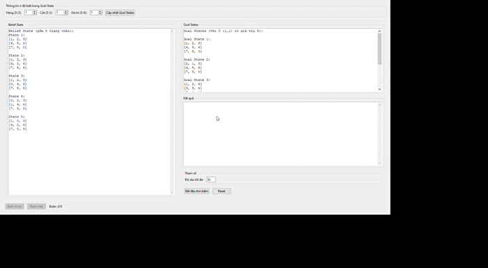

*Cách tiếp cận:*
- Sử dụng các hành động cảm biến để thu thập thông tin
- Cập nhật niềm tin về trạng thái thực tế dựa trên thông tin thu thập được
- Kết hợp thu thập thông tin và hành động để đạt được mục tiêu

### 2.6. Bài toán thỏa mãn ràng buộc (CSP)

#### Xây dựng bài toán 8-puzzle dưới dạng CSP

Bài toán 8-puzzle có thể được mô hình hóa như một bài toán thỏa mãn ràng buộc (CSP) như sau:

**Biến:**
- 9 biến đại diện cho 9 vị trí trên bảng (từ (0,0) đến (2,2))
- Mỗi biến có thể chứa một giá trị từ 0 đến 8, trong đó 0 đại diện cho ô trống

**Miền giá trị:**
- Miền giá trị của mỗi biến là tập hợp {0, 1, 2, 3, 4, 5, 6, 7, 8}

**Ràng buộc:**
- Mỗi giá trị từ 0 đến 8 phải xuất hiện đúng một lần trên bảng
- Các hành động hợp lệ chỉ cho phép ô trống di chuyển lên, xuống, trái, phải
- Trạng thái cuối cùng phải khớp với trạng thái đích

Tuy nhiên, cần lưu ý rằng CSP thường được sử dụng để tìm một trạng thái thỏa mãn các ràng buộc, không phải để tìm một chuỗi hành động. Do đó, khi áp dụng CSP cho 8-puzzle, chúng ta thường tìm kiếm một chuỗi các CSP, mỗi CSP đại diện cho một bước trong giải pháp.

#### Chi tiết các thuật toán

**1. Backtracking**

Backtracking là thuật toán cơ bản nhất cho CSP, thử gán giá trị cho các biến theo thứ tự và quay lui khi gặp xung đột.
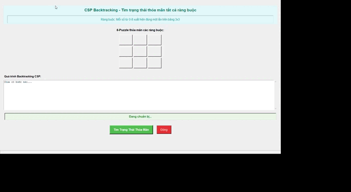

*Cách tiếp cận:*
- Chọn một biến chưa được gán giá trị
- Thử gán các giá trị từ miền giá trị của biến đó
- Kiểm tra tính nhất quán với các ràng buộc
- Nếu gặp xung đột, quay lui và thử giá trị khác

*Ưu điểm:*
- Đơn giản và dễ triển khai
- Đảm bảo tìm được giải pháp nếu có

*Nhược điểm:*
- Không hiệu quả cho các bài toán lớn
- Có thể mất nhiều thời gian để khám phá các nhánh không có giải pháp

**2. AC-3 Search (Arc Consistency Algorithm #3)**

AC-3 là một thuật toán tiền xử lý để loại bỏ các giá trị không phù hợp từ miền của các biến, đảm bảo tính nhất quán cung (arc consistency).
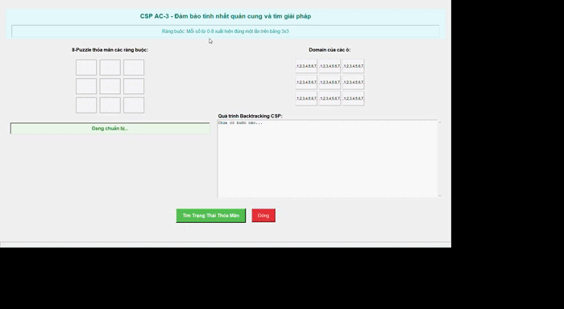

*Cách tiếp cận:*
- Duy trì một hàng đợi các cặp biến có ràng buộc với nhau
- Loại bỏ các giá trị không phù hợp từ miền của các biến
- Lặp lại quá trình cho đến khi không còn giá trị nào bị loại bỏ

*Ưu điểm:*
- Giảm đáng kể không gian tìm kiếm
- Có thể kết hợp với Backtracking để tăng hiệu suất

*Nhược điểm:*
- Không đảm bảo tìm được giải pháp mà không cần Backtracking
- Có thể tốn nhiều thời gian cho các ràng buộc phức tạp

**3. Min-Conflicts Search**

Min-Conflicts là một thuật toán tìm kiếm cục bộ cho CSP, bắt đầu từ một trạng thái đầy đủ (có thể không thỏa mãn tất cả các ràng buộc) và cố gắng giảm số lượng xung đột.
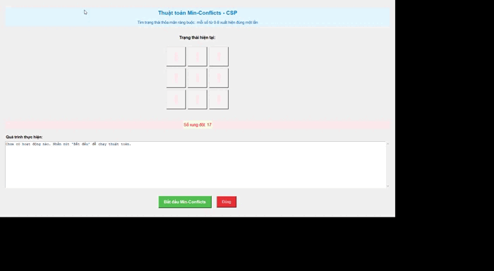

*Cách tiếp cận:*
- Bắt đầu với một trạng thái đầy đủ (gán giá trị cho tất cả các biến)
- Lặp lại: chọn một biến có xung đột và gán lại giá trị để giảm số lượng xung đột
- Tiếp tục cho đến khi không còn xung đột hoặc đạt đến số lần lặp tối đa

*Ưu điểm:*
- Hiệu quả cho nhiều bài toán CSP lớn
- Có thể tìm được giải pháp nhanh chóng trong nhiều trường hợp

*Nhược điểm:*
- Không đảm bảo tìm được giải pháp
- Có thể bị mắc kẹt ở cực tiểu cục bộ

### 2.7. Học tăng cường (Reinforcement Learning)

#### Q-Learning cho bài toán 8-puzzle

Q-Learning là một thuật toán học tăng cường không cần mô hình, học cách đưa ra quyết định tối ưu thông qua tương tác với môi trường.

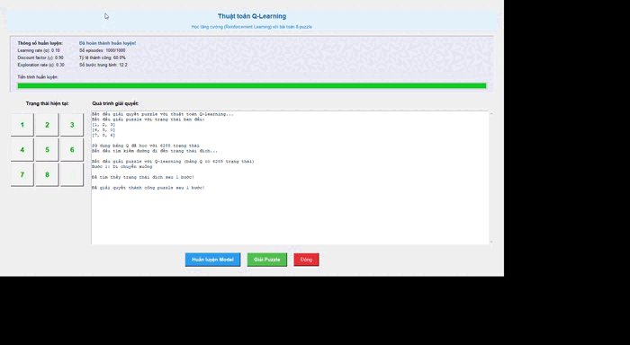

Bài toán 8-puzzle có thể được mô hình hóa như một MDP:
- Trạng thái (S): Các cấu hình có thể có của bảng 8-puzzle
- Hành động (A): Di chuyển ô trống lên, xuống, trái, phải
- Phần thưởng (R): Thường là âm cho mỗi bước (-1), dương lớn khi đạt đến trạng thái đích
- Xác suất chuyển tiếp (P): Trong 8-puzzle, P(s'|s,a) = 1 cho trạng thái s' duy nhất sau khi thực hiện hành động a từ trạng thái s

**Trạng thái, hành động, phần thưởng:**

Trong triển khai Q-Learning cho 8-puzzle:
- Trạng thái được biểu diễn bằng ma trận 3x3
- Hành động là các di chuyển hợp lệ của ô trống
- Phần thưởng có thể được thiết kế như sau:
  - Phần thưởng âm nhỏ (-1) cho mỗi bước di chuyển
  - Phần thưởng dương lớn (+100) khi đạt đến trạng thái đích
  - Phần thưởng âm lớn (-10) cho các di chuyển không hợp lệ hoặc quay lại trạng thái đã đi qua

**Công thức cập nhật Q-value:**

Q-Learning cập nhật bảng Q theo công thức:

Q(s,a) = Q(s,a) + α * [R + γ * max(Q(s',a')) - Q(s,a)]

Trong đó:
- Q(s,a) là giá trị Q của cặp trạng thái-hành động (s,a)
- α là tỷ lệ học tập (learning rate)
- R là phần thưởng nhận được
- γ là hệ số chiết khấu (discount factor)
- max(Q(s',a')) là giá trị Q tối đa có thể đạt được từ trạng thái tiếp theo s'

**Chiến lược epsilon-greedy:**

Để cân bằng giữa khám phá và khai thác, Q-Learning thường sử dụng chiến lược epsilon-greedy:
- Với xác suất ε: chọn một hành động ngẫu nhiên (khám phá)
- Với xác suất 1-ε: chọn hành động có giá trị Q cao nhất (khai thác)

#### Cải tiến thuật toán Q-learning

**Hệ thống phần thưởng tối ưu:**

Một cải tiến quan trọng trong triển khai Q-Learning cho 8-puzzle là thiết kế hệ thống phần thưởng phù hợp:
- Phần thưởng dựa trên số ô đúng vị trí: +10 cho mỗi ô đúng vị trí
- Phạt cho các di chuyển không cải thiện trạng thái: -5 cho các di chuyển làm giảm số ô đúng vị trí
- Phần thưởng lớn cho trạng thái đích: +100

**Phát hiện và thoát khỏi vòng lặp trạng thái:**

Một vấn đề phổ biến trong Q-Learning cho 8-puzzle là agent có thể bị mắc kẹt trong vòng lặp trạng thái. Để khắc phục:
- Lưu trữ lịch sử các trạng thái đã đi qua trong một episode
- Phạt nặng (-20) cho các di chuyển dẫn đến trạng thái đã đi qua
- Tăng cường khám phá khi phát hiện vòng lặp

**Huấn luyện tại chỗ với trạng thái chưa biết:**

Khi gặp trạng thái chưa có trong bảng Q, thay vì khởi tạo ngẫu nhiên, có thể:
- Thực hiện huấn luyện nhanh tại chỗ với trạng thái đó
- Sử dụng hàm heuristic (như Manhattan Distance) để ước tính giá trị ban đầu
- Chia nhỏ không gian trạng thái bằng cách tập trung vào các trạng thái gần với trạng thái đích

#### Hiệu suất và so sánh

**Thời gian huấn luyện vs. hiệu suất giải quyết:**

Q-Learning đòi hỏi thời gian huấn luyện đáng kể để xây dựng bảng Q, nhưng sau khi huấn luyện, việc giải quyết bài toán có thể rất nhanh:
- Thời gian huấn luyện: Có thể mất từ vài phút đến vài giờ tùy thuộc vào kích thước không gian trạng thái và các tham số
- Thời gian giải quyết: Thường rất nhanh, chỉ cần tra cứu bảng Q để chọn hành động tốt nhất ở mỗi bước

**So sánh với các phương pháp tìm kiếm cổ điển:**

So với các thuật toán tìm kiếm cổ điển:
- A*: Nhanh hơn và tối ưu hơn Q-Learning cho các trường hợp cụ thể, nhưng không có khả năng học từ kinh nghiệm
- BFS/DFS: Đảm bảo tìm được giải pháp (nếu có), nhưng không hiệu quả cho các không gian trạng thái lớn
- Hill Climbing: Nhanh nhưng dễ bị mắc kẹt ở cực tiểu cục bộ

Ưu điểm chính của Q-Learning là khả năng học từ kinh nghiệm và cải thiện hiệu suất theo thời gian, đặc biệt hữu ích khi cần giải quyết nhiều lần các bài toán tương tự.

## 3. Hướng dẫn sử dụng

### Cài đặt

**Yêu cầu hệ thống:**
- Python 3.6 trở lên
- Hệ điều hành: Windows, macOS, hoặc Linux

**Thư viện phụ thuộc:**
- tkinter: Thư viện GUI mặc định của Python
- numpy: Thư viện hỗ trợ xử lý mảng và ma trận

**Các bước cài đặt:**
1. Clone hoặc tải xuống mã nguồn từ repository:
   ```
   git clone 
   ```

2. Cài đặt các thư viện phụ thuộc:
   ```
   pip install numpy pillow
   ```
   
3. Chạy ứng dụng:
   ```
   python main.py
   ```

### Sử dụng cơ bản

**Thiết lập trạng thái ban đầu và trạng thái đích:**
1. Khi khởi động ứng dụng, bạn sẽ thấy ba bảng puzzle: trạng thái ban đầu (bên trái), trạng thái đích (bên phải), và bảng visualization (ở giữa).
2. Để thiết lập trạng thái ban đầu hoặc đích, bạn có thể:
   - Nhấp vào các ô số và nhập từ bàn phím
   - Sử dụng nút "Dữ liệu mẫu" để tạo trạng thái ngẫu nhiên
   - Sử dụng nút "Reset" để đặt lại về trạng thái mặc định

**Chọn và chạy thuật toán:**
1. Chọn một thuật toán từ các tab thuật toán (Uninformed, Informed, Local, Special, CSP, Reinforcement Learning)
2. Nhấp vào nút "Solve Puzzle" để bắt đầu giải bài toán
3. Theo dõi quá trình giải trên bảng visualization ở giữa

**Xem và phân tích kết quả:**
1. Kết quả giải sẽ được hiển thị trong khu vực văn bản bên dưới bảng visualization
2. Thông tin hiển thị bao gồm:
   - Thuật toán được sử dụng
   - Thời gian giải
   - Số bước trong giải pháp
   - Số nút đã khám phá

### Ví dụ minh họa

**Ví dụ 1: Giải bài toán 8-puzzle đơn giản bằng BFS**
1. Thiết lập trạng thái ban đầu gần với trạng thái đích (chỉ khác nhau 2-3 vị trí)
2. Chọn thuật toán BFS từ tab "Uninformed"
3. Nhấp "Solve Puzzle" và theo dõi quá trình giải
4. Kết quả sẽ hiển thị đường đi ngắn nhất từ trạng thái ban đầu đến trạng thái đích

**Ví dụ 2: So sánh hiệu suất giữa A* và Greedy Search**
1. Thiết lập trạng thái ban đầu phức tạp (cách xa trạng thái đích)
2. Chạy thuật toán A* và ghi lại kết quả
3. Đặt lại trạng thái ban đầu giống như trước
4. Chạy thuật toán Greedy Search và ghi lại kết quả
5. So sánh thời gian giải, số bước, và số nút đã khám phá giữa hai thuật toán

**Ví dụ 3: Sử dụng Q-Learning**
1. Chọn thuật toán Q-Learning từ tab "Reinforcement Learning"
2. Nhấp "Train" để huấn luyện agent (có thể mất một chút thời gian)
3. Sau khi huấn luyện, nhấp "Solve Puzzle" để xem agent giải bài toán
4. Theo dõi quá trình giải và phân tích kết quả

## 4. Kết luận

### Kết quả đạt được

**Tổng kết các kết quả chính:**
1. Đã xây dựng thành công một ứng dụng toàn diện để giải bài toán 8-puzzle với nhiều thuật toán khác nhau
2. Triển khai thành công 20+ thuật toán tìm kiếm từ các nhóm khác nhau: không thông tin, có thông tin, cục bộ, CSP,tìm kiếm trong môi trường phức tạp và học tăng cường
3. Tạo giao diện người dùng trực quan, cho phép dễ dàng thiết lập bài toán và theo dõi quá trình giải
4. Cung cấp công cụ so sánh hiệu suất giữa các thuật toán
5. Khả năng lưu file đường đi đến đích một cácht tự động
**Các phát hiện quan trọng về hiệu suất thuật toán:**
1. Thuật toán A* với heuristic Manhattan Distance thường là lựa chọn tốt nhất về mặt cân bằng giữa thời gian và tối ưu
2. IDA* là lựa chọn tốt khi bộ nhớ hạn chế
3. Các thuật toán tìm kiếm cục bộ như Hill Climbing thường không hiệu quả cho bài toán 8-puzzle do dễ bị mắc kẹt ở cực tiểu cục bộ
4. Q-Learning cần thời gian huấn luyện đáng kể nhưng có thể giải quyết bài toán nhanh chóng sau khi huấn luyện

### Những thách thức

**Các khó khăn gặp phải trong quá trình triển khai:**
1. Xử lý các trường hợp đặc biệt trong bài toán 8-puzzle, như việc không phải mọi cấu hình đều có thể đạt được từ mọi cấu hình khác
2. Tối ưu hóa hiệu suất của các thuật toán tìm kiếm cho không gian trạng thái lớn
3. Thiết kế hệ thống phần thưởng hiệu quả cho Q-Learning
4. Xây dựng giao diện người dùng trực quan và thân thiện

### Hướng phát triển tương lai

**Cải tiến thuật toán:**
1. Tích hợp các heuristic nâng cao hơn cho A* và các thuật toán tìm kiếm có thông tin
2. Cải thiện hiệu suất của Q-Learning thông qua các kỹ thuật như Experience Replay và Deep Q-Network
3. Triển khai các thuật toán CSP nâng cao như Forward Checking và MAC

**Mở rộng cho các bài toán khác:**
1. Mở rộng ứng dụng để hỗ trợ các biến thể khác như 15-puzzle, 24-puzzle
2. Áp dụng các thuật toán đã triển khai cho các bài toán tương tự như Rubik's Cube, Sokoban
3. Tích hợp các bài toán tìm kiếm khác vào cùng một nền tảng

**Tối ưu hóa hiệu suất:**
1. Tối ưu hóa cấu trúc dữ liệu và thuật toán để giảm thời gian tính toán
2. Triển khai tính toán song song cho các thuật toán phù hợp
3. Sử dụng các kỹ thuật cắt tỉa (pruning) nâng cao để giảm không gian tìm kiếm

# CẢM ƠN MỌI NGƯỜI ĐÃ XEM 